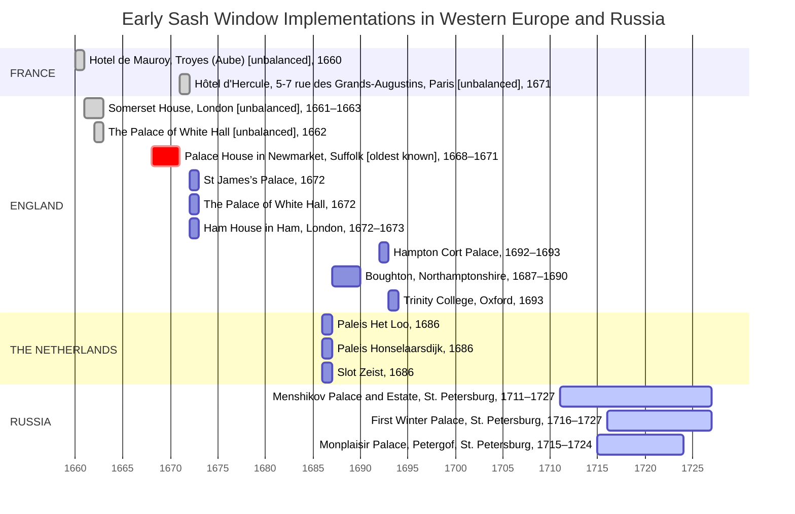

# Early Sash Window Implementations in Western Europe and Russia (Timeline Diagram)



## Legend

This diagram illustrates the earliest confirmed occurrences of *sash windows* across Europe, as well as their initial documented appearances in **early 18th-century Petrine Russia**. The aim of this study is to investigate potential transmission routes through which the sash window design may have been introduced into Russian architectural practice.

The label `unbalanced` refers to early vertically sliding windows that lacked a counterbalancing mechanism — such as cords, pulleys, and weights — typically associated with the fully developed sash window system.

The dates indicated in the diagram correspond to documented instances of sash window installation in the specified buildings. Where such precise information is unavailable, the general construction period of the building is provided instead.

The chronology and data pertaining to Western Europe are primarily derived from the research of *Dr H. Louw*. Additional references and sources are listed in the [*Sources*](#sources) section.


## Sources
1. Andreeva, E. A. *Peterburgskaya rezidenciya A. D. Menshikova v pervoj treti XVIII v.: Opisaniya palat, khorom i sada: Issledovanie i dokumenty* (Petersburg's residence of A. D. Menshikov in the First Third of the XVIII century: Inventories of the chambers, domain and garden). Saint Petersburg: Istoricheskaya illyustraciya, 2013. 360 pp. *(In Russian*)
1. Arkhipov, N. I. *Nikolai Il'ich Arkhipov. Issledovaniia po istorii Petergofa* (Nikolai Il’ich Arkhipov: Research on the History of Peterhof). Saint Petersburg: GMZ «Peterhof», 2016. 591 pp. *(In Russian*) https://peterhofmuseum.ru/assets/files/20170904/d31f3f8b1f758a51bf5a5c633e53da57.pdf
1. Baggs, A. P. "The Earliest Sash-Window in Britain?" *The Georgian Group Journal* 7 (1997): 168–171. https://georgiangroup.org.uk/wp-content/uploads/2020/10/GGJ_1997_Vol_7_16_Baggs_0001.pdf
1. Bayley, J., Doonan, R., Dungworth, D. "The Earliest Sash-Window in England?" In *Verre et Fenêtre de l’Antiquité au XVIIIe siècle* (Glass and Window from Antiquity to the 18th Century), Proceedings of the First International Colloquium held in Paris-La Défense / Versailles, October 13–15, 2005. https://www.verre-histoire.org/colloques/verrefenetre/pages/p422_01_bayley.html
1. Louw, H. J. "The Development of the Window: History, Repair and Conservation". In *Windows*, ed. by M. Tutton, E. Hirst, J. Pearce, 7–96. London: Routledge, 2015. https://www.researchgate.net/publication/329694492_The_Development_of_the_Window_History_Repair_and_Conservation
1. Louw, H. J. “The Origin of the Sash-Window.” *Architectural History* 26 (1983): 49. [10.2307/1568434](https://doi.org/10.2307/1568434).
1. Louw, H. J., and Crayford, R. "A Constructional History of the Sash-Window c. 1670–c.1725 (Part 1)." *Architectural History* 41 (1998): 82–130. [10.2307/1568649](https://doi.org/10.2307/1568649).
1. Louw, H. J., and Crayford, R. "A Constructional History of the Sash-Window, c. 1670–c.1725 (Part 2)." *Architectural History* 42 (1999): 173–239. [10.2307/1568709](https://doi.org/10.2307/1568709).
1. Trubinov, Yu. V. *Palaty svetlejshego knyazya Menshikova : 300-letiyu Sankt-Peterburga posvyashchaetsya*  (The Palace of His Serene Highness Prince Menshikov: Dedicated to the 300th Anniversary of Saint Petersburg). Saint Petersburg: Levsha, 2003. 168 pp. *(In Russian*)
1. Wittrick, A. *Palace House Mansion Palace Street, Newmarket, Suffolk: Report Outlining the Analysis and Interpretation of a Late Seventeenth-Century, Solid-Frame, Counterbalanced, Sash Window*. 1999. [10.5284/1058141](https://doi.org/10.5284/1058141).


## Citation

```
Tropin, Valery. "Early Sash Window Implementations in Western Europe and Russia (Timeline Diagram)." In Sash Windows from the Menshikov Palace in St. Petersburg, Russia. 2025. GitHub repository. File: TIMELINE_EARLY_SASH_WINDOWS.md, commit <commit hash>.  
https://github.com/tropintropin/sash_windows/blob/<commit_hash>/TIMELINE_EARLY_SASH_WINDOWS.md
```

<details>
    <summary><b>How to Cite a Specific Version of This File</b></summary>

The `<commit hash>` is the unique code for this version. Find it by clicking *History* on the file page, select a *commit*, and copy the code from the URL.

To link to an exact version of this file (so the citation doesn’t break when the file changes), follow these steps:

1. Open the file on GitHub, for example: `https://github.com/tropintropin/sash_windows/blob/main/TIMELINE_EARLY_SASH_WINDOWS.md`
1. Click the *History* button near the top right to see all changes to this file.
1. Find the commit you want to cite and click on it.
1. Copy the URL from your browser’s address bar — this links to the file at that exact commit.

Use this URL in your citation to ensure it always points to the same version.
</details>
