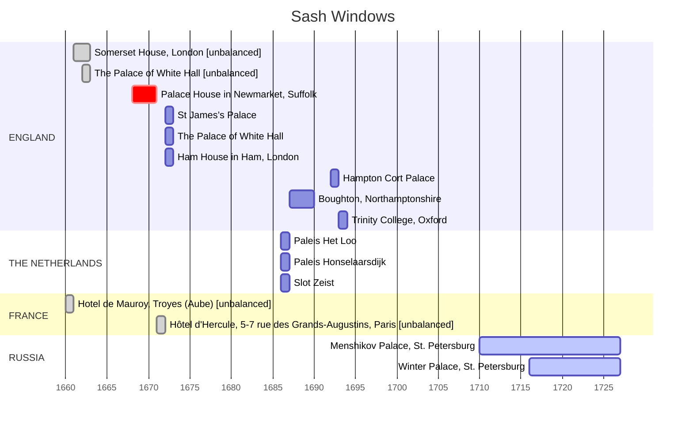

# Early Sash Windows in the Europe

## Sources
1. Baggs A. P. The Earliest Sash-Window in Britain? // The Georgian Group Jounal. 1997. (VII). C. 168–171.
1. Bayley J., Doonan R., Dungworth D. The Earliest Sash-Window in England? // Verre et Fenêtre de l’Antiquité au xviiie siècle, les Actes du premier colloque international organisé à Paris-La Défense / Versailles du 13 au 15 octobre 2005 par l’Association Verre & Histoire. 2005.
1. Louw H. J. The Development of the Window: History, Repair and Conservation под ред. M. Tutton, E. Hirst, J. Pearce, Routledge, 2015.C. 7–96. doi: 10.4324/9781315793832-2.
1. Louw H. J. The Origin of the Sash-Window // Architectural History. 1983. (26). C. 49. doi: 10.2307/1568434.
1. Louw H. J., Crayford R. A Constructional History of the Sash-Window c. 1670-c.1725 (Part 1) // Architectural History. 1998. (41). C. 82–130. doi: 10.2307/1568649.
1. Louw H. J., Crayford R. A Constructional History of the Sash-Window, c. 1670-c. 1725 (Part 2) // Architectural History. 1999. (42). C. 173. doi: 10.2307/1568709.
1. Wittrick A. Palace House Mansion Palace Street, Newmarket, Suffolk: Report Outlining the Analysis and Interpretation of a Late Seventeenth-Century, Solid-Frame, Counterbalanced, Sash Window 1999. doi: 10.5284/1058141.